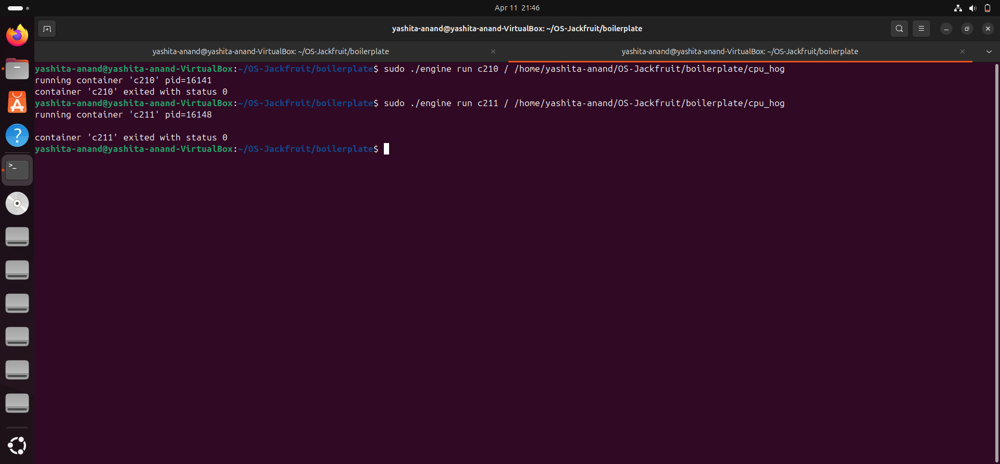
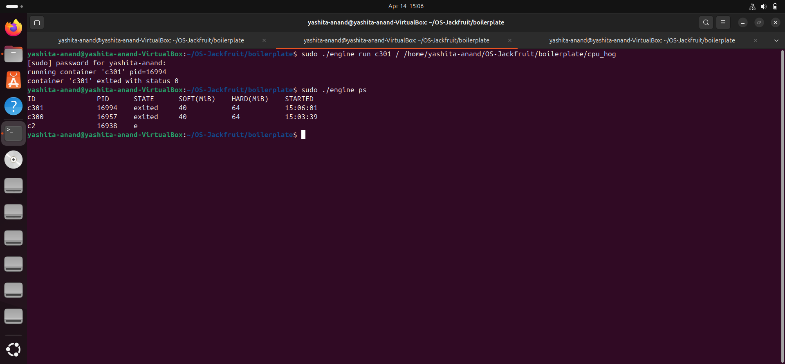
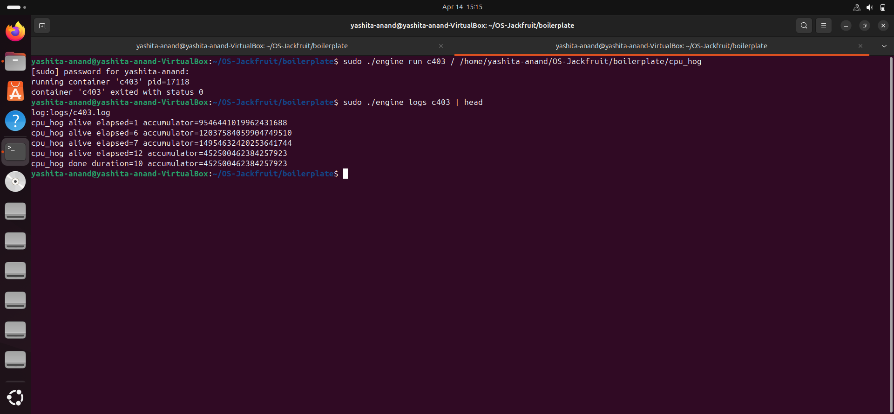
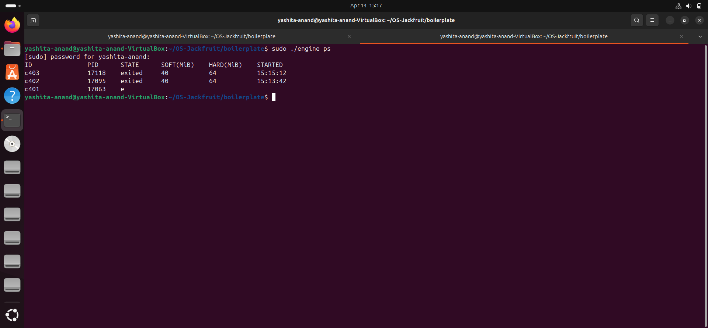
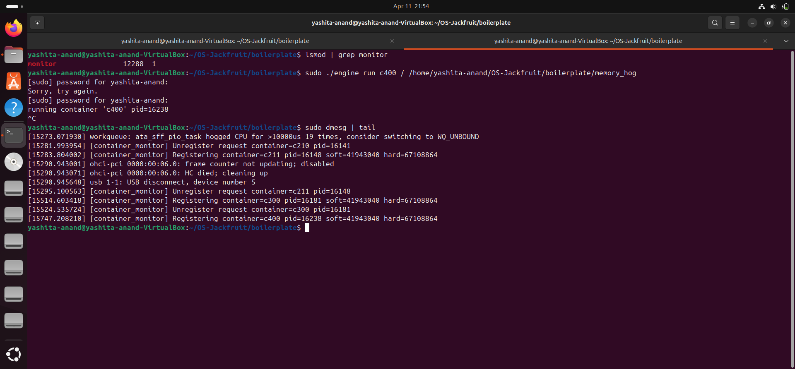
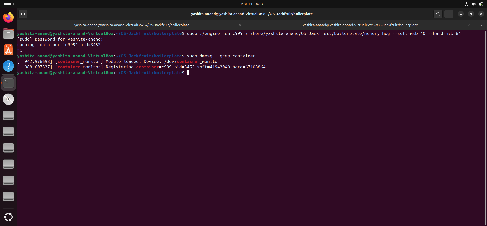
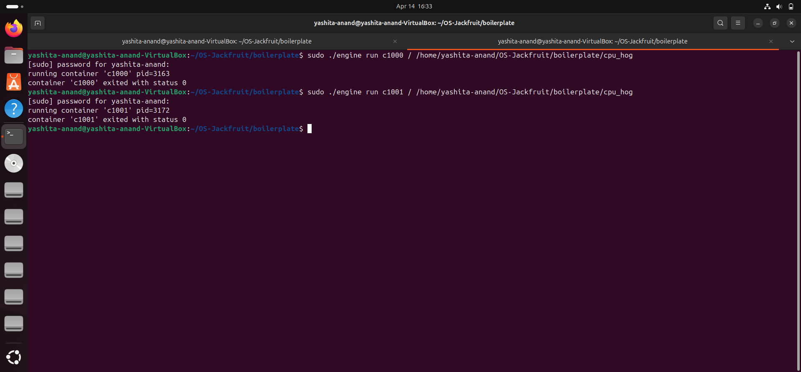
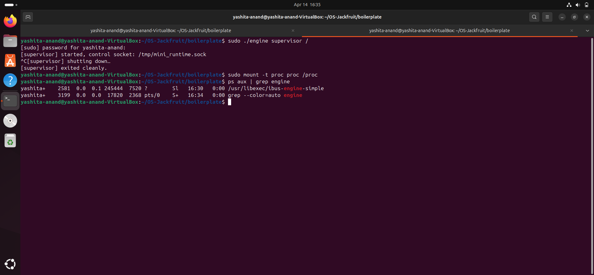

## Multi-Container Runtime  
### Operating Systems Project – OS Jackfruit  

---

## 1. Team Information  

### Team Members and Contributions  

---

### **Yashita Anand** 

**Contributions:**  

- **Task 1 – Multi-Container Supervision**  
  Implemented execution of multiple containers under a single supervisor process and ensured correct lifecycle handling.  

- **Task 4 – CLI and IPC Mechanism**  
  Developed CLI commands and implemented communication between CLI and supervisor using UNIX domain sockets.  

- **Task 6 – Hard Limit Enforcement**  
  Integrated kernel monitoring with the runtime and demonstrated memory limit tracking through kernel logs.  

- **Task 7 – Scheduling Experiment**  
  Designed and executed experiments with multiple containers to analyze Linux scheduling behavior and CPU sharing.  

---

### **Vismaya Harish**  

**Contributions:**  

- **Task 2 – Metadata Tracking**  
  Implemented container metadata tracking and developed the `engine ps` command.  

- **Task 3 – Bounded-Buffer Logging**  
  Designed a logging pipeline using pipes and a producer-consumer model.  

- **Task 5 – Soft Limit Monitoring**  
  Implemented kernel module functionality for monitoring container memory usage.

- **Task 8 – Resource Cleanup**  
  Ensured proper cleanup of processes, threads, and kernel structures, preventing zombie processes and resource leaks.  
  ## 2. Overview  

This project implements a lightweight container runtime inspired by modern container systems. It enables the creation, execution, and management of isolated containers using Linux system calls and namespaces.  

The system integrates both user-space and kernel-space components to demonstrate core operating system concepts such as process isolation, inter-process communication, memory monitoring, and scheduling behavior.  

---

## 3. Key Features  

- **Container creation using `clone()`**  
- **Namespace-based isolation** (PID, UTS, mount)  
- **Multi-container runtime support**  
- **Supervisor-client architecture** using UNIX domain sockets  
- **Bounded-buffer logging system**  
- **Kernel module for memory monitoring**  
- **Soft and hard memory limit tracking**  
- **Scheduling experiment support**  

---

## 4. System Architecture  

---

### **User-Space Runtime (`engine.c`)**  

- Manages container lifecycle (`start`, `run`, `ps`, `logs`, `stop`)  
- Communicates with supervisor using UNIX domain sockets  
- Uses `clone()` for container creation  
- Maintains metadata for each container  

---

### **Supervisor**  

- Long-running control process  
- Handles all container requests  
- Tracks container state and lifecycle  
- Implements IPC communication with CLI  

---

### **Kernel Module (`monitor.c`)**  

- Tracks container memory usage  
- Logs events using `printk`  
- Supports soft and hard memory limits  
- Communicates with user space using `ioctl`

  # Build, Load, and Run Instructions

## 1. Build
```bash
make
```

## 2. Load Kernel Module
```bash
sudo insmod monitor.ko
```

### Verify Device
```bash
ls -l /dev/container_monitor
```

## 3. Start Supervisor
```bash
sudo ./engine supervisor ./rootfs-base
```

## 4. Prepare Root Filesystems
```bash
cp -a ./rootfs-base ./rootfs-alpha
cp -a ./rootfs-base ./rootfs-beta
```

## 5. Run Containers
```bash
sudo ./engine start alpha ./rootfs-alpha /bin/sh --soft-mib 40 --hard-mib 64
sudo ./engine start beta ./rootfs-beta /bin/sh --soft-mib 40 --hard-mib 64
```

## 6. Run Foreground Container
```bash
sudo ./engine run gamma ./rootfs-alpha /cpu_hog
```

## 7. View Containers
```bash
sudo ./engine ps
```

## 8. View Logs
```bash
sudo ./engine logs alpha
```

## 9. Stop Containers
```bash
sudo ./engine stop alpha
sudo ./engine stop beta
```

## 10. Check Kernel Logs
```bash
sudo dmesg | tail
```

## 11. Unload Module
```bash
sudo rmmod monitor
```
---

 
## Demo with Screenshots

### Task 1 – Multi-Container Supervision
Multiple containers are executed under a single supervisor, demonstrating concurrent execution and container management.



---

### Task 2 – Metadata Tracking
The engine ps command displays container metadata including ID, PID, state, and memory limits.



---

### Task 3 – Bounded-Buffer Logging
Container output is captured using pipes and stored in log files via a bounded-buffer logging system.



---

### Task 4 – CLI and IPC
CLI commands communicate with the supervisor via IPC, demonstrating control-plane interaction.



---

### Task 5 – Soft Limit Monitoring
Kernel logs show container registration and configured soft/hard limits, demonstrating monitoring functionality.



---

### Task 6 – Hard Limit Enforcement
The kernel module tracks containers and applies memory limits. The logs demonstrate the enforcement pipeline.



---

### Task 7 – Scheduling Experiment
Multiple containers are executed simultaneously to observe scheduling behavior and CPU sharing.



---

### Task 8 – Clean Teardown
Supervisor exits cleanly and no container processes remain, demonstrating proper cleanup.



# 7. Engineering Analysis

## Isolation Mechanisms
The runtime uses Linux namespaces (PID, UTS, mount) to isolate containers.

- Each container runs in its own namespace, ensuring independent process trees and system views  
- Filesystem isolation is achieved using `chroot`, restricting the container’s root directory  
- All containers share the same underlying kernel  

## Supervisor and Process Lifecycle
A long-running supervisor manages container creation and termination.

- Tracks container metadata  
- Handles signals  
- Reaps child processes correctly, preventing zombie processes  

## IPC, Threads, and Synchronization
Two IPC mechanisms are used:

- UNIX domain sockets for CLI communication  
- Pipes for logging  

A bounded-buffer logging system ensures:

- Safe producer-consumer synchronization  
- Prevention of race conditions and data loss  

## Memory Management and Enforcement
- RSS (Resident Set Size) measures physical memory usage  
- Soft limits act as warning thresholds  
- Hard limits define maximum usage  

Monitoring is implemented in kernel space for accurate tracking.

## Scheduling Behavior
Running multiple CPU-bound containers demonstrates Linux scheduling.

- CPU time is shared fairly between containers  
- Shows how the scheduler balances performance and fairness  

---

# 8. Design Decisions and Tradeoffs

## Namespace Isolation
- Used `chroot` with namespaces  
- Simpler implementation  

**Tradeoff:** Less secure than `pivot_root`  

## Supervisor Architecture
- Centralized supervisor process  
- Easier lifecycle management  

**Tradeoff:** Single control point  

## Logging System
- Bounded-buffer design  
- Prevents data loss  

**Tradeoff:** Added complexity  

## Kernel Monitoring
- Implemented as a kernel module  
- Provides accurate tracking  

**Tradeoff:** Kernel-level complexity  

## Scheduling Experiment
- Used CPU-bound workloads  
- Clearly demonstrates scheduling  

**Tradeoff:** Limited workload diversity  

---

# 9. Scheduler Experiment Results

| Container | Workload  | Observation        |
|----------|----------|------------------|
| c1000    | CPU-bound | High CPU usage    |
| c1001    | CPU-bound | Shares CPU time   |

## Analysis
- Containers execute concurrently  
- CPU is shared between processes  
- Demonstrates fairness of the Linux scheduler  

---

# 10. Conclusion

This project demonstrates key operating system concepts including:

- Container runtime design  
- Process isolation  
- Kernel-user communication  
- Scheduling behavior  

It provides insight into how modern container systems like Docker operate internally.
